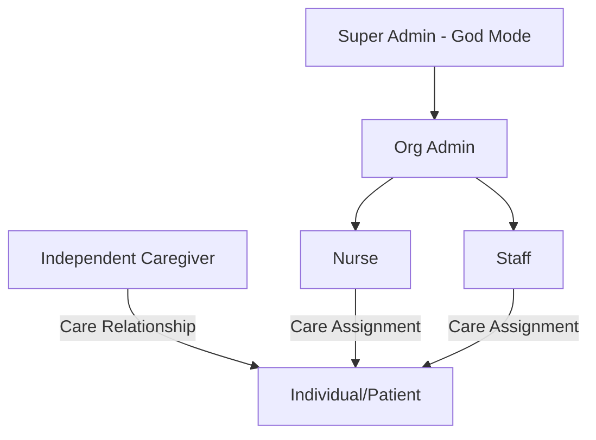

# KithCare — Product & System Documentation

This document provides a comprehensive overview of the **KithCare** platform, capturing the application structure, data models, role and permission mappings, and Row-Level Security (RLS) policies based on the database schema.

---

## 1. System Overview & User Roles

KithCare is a collaborative caregiving platform designed for both **independent home-care** (family/caregiver relationships) and **agency/facility care** (organizations with structured staff roles).

### Identity & Profile Hierarchy

The system defines two primary types of profiles (stored in `public.profiles`):
1. **Caregivers**: Users linked to an authentication account (`auth.users`) who administer care, log events, and manage records.
2. **Individuals (Patients/Residents)**: Profiles representing the recipients of care. These profiles do *not* have direct credentials to log in, but are managed by caregivers or organization staff.

### Roles and Permissions Matrix

| Context | Role | Description |
| :--- | :--- | :--- |
| **Platform-wide** | **Super Admin** | Platform owners (have `is_super_admin = true`). Can bypass standard restrictions to manage system-wide settings. |
| **Organization Level** | **Admin** | Manages organization settings, staff memberships, invitations, and patient assignments. Has full management rights over organization data. |
| **Organization Level** | **Nurse** | Staff member with professional clinical responsibilities. Status can be `active` or `inactive`. |
| **Organization Level** | **Staff** | Care provider with daily caregiving responsibilities. Status can be `active` or `inactive`. |
| **Care Relationship** | **Owner** | Caregiver with full control over an individual's care profile. Can add other caregivers and edit legal files. |
| **Care Relationship** | **Editor** | Caregiver permitted to log care, add medications, update diaries, and edit clinical records. |
| **Care Relationship** | **Viewer** | Typically family members or observers. Read-only access to the individual's records. |

---

## 2. Core Features & Data Models

### 2.1 Profiles & Legal Directives (`public.profiles`)
Represents both caregivers and patients. Patients have advanced clinical and legal attributes:
*   **Demographics**: Full name, DOB, phone, address, gender/sex (`male`, `female`, `other`).
*   **Legal Directives**:
    *   `dnr_status` (Boolean) & `dnr_document_url` (Link to signed document)
    *   `living_will_status` (Boolean) & `living_will_document_url`
    *   `poa_name`, `poa_phone`, `poa_email` (Power of Attorney contact details)
    *   `end_of_life_wishes` (Free text)

### 2.2 Care Relationships & Assignments
*   **`care_relationships`**: Maps independent caregivers to individuals with roles (`owner`, `editor`, `viewer`).
*   **`care_assignments`**: Maps organization staff members (nurse/staff) to specific residents.

### 2.3 Daily Logs & Observations
*   **Journal Entries (`journal_entries`)**: Text updates, mood tracking (`happy`, `sad`, `anxious`, etc.), and photo attachments with captions. Supports a `is_personal` flag to isolate a caregiver's private thoughts from the shared patient logs.
*   **Daily Care Logs (`daily_care_logs`)**: Tracked once per day per individual.
    *   *Sleep*: Sleep hours, bed time, wake time, and quality.
    *   *ADLs (Activities of Daily Living)*: Bathing, dressing, toileting, mobility, and feeding (tracked as `independent`, `assisted`, `dependent`, or `not_applicable`).
    *   *Hydration & Mood*.
*   **Dietary Logs (`dietary_logs`)**: Records meal types (Breakfast, Lunch, Dinner, Snack), appetite levels (Good, Fair, Poor, Refused), and custom feeding notes.

### 2.4 Medical Management
*   **Medications (`medications`)**: Drug name, dosage, frequency, scheduled administration times, instructions, and prescribing clinician.
*   **Medication Logs (`medication_logs`)**: Timestamps of doses, marked as `taken`, `missed`, or `skipped` with administrator notes.
*   **Clinicians & Visits (`clinicians`, `clinical_visits`)**: Directory of care providers (specialty, contact info) and records of medical visits, reasons, notes, and follow-up dates.

### 2.5 Handoffs & Shift Tracking
*   **Work Notes (`work_notes`)**: Care coordination messages categorized by priority (`low`, `normal`, `high`, `urgent`) and type (`observation`, `update`, `coordination`, `concern`, `general`), with a resolution toggle.
*   **Shifts (`shifts`)**: Timecards tracking a caregiver's shift start/end, active status, and shift summary data (handoff notes, mood summary, and medication counts).

---

## 3. Row-Level Security (RLS) Analysis

The database uses Supabase RLS to separate organization data and independent care data.

### Critical Policy Paths

*   **Profiles SELECT**:
    *   Caregivers can view their own profile.
    *   Caregivers can view individuals they manage via `care_relationships`.
    *   Organization members can view colleagues and patients belonging to their organization.
*   **Data Table Access**:
    *   *Caregivers*: Allowed to view/edit data (Journal, Meds, Logs, Documents, Contacts) if they have an active `care_relationships` link to the patient.
    *   *Org Admins*: Allowed to manage all patient data within their organization via the `Org Admins manage *` policies.

---

## 4. Logical Loopholes & Missing Functionalities

During the database sweep, several critical logical loopholes and functional gaps were discovered:

### ⚠️ Security Loophole: Inactive Staff Data Access
The organization helper functions `current_user_is_member_of` and `current_user_is_org_admin` check for the existence of a member row, but **do not** check if the member's status is `active`.
*   **Impact**: If an admin changes a staff member's status to `inactive` (deactivation), that staff member **retains full read and write access** to all organization tables under any policy using these helpers.

### ⚠️ Data Compliance Loophole: Complete Shift Control
Caregivers have `ALL` permissions on the `shifts` table for rows where they are the caregiver.
*   **Impact**: Caregivers can retroactively edit `start_time` and `end_time` or delete shift rows entirely. In professional care environments, this allows for the falsification of billing/working hours. Completed shifts should be locked and editable only by admins or through an audit workflow.

### ⚠️ Audit Gaps in Critical Legal Fields
The DNR status, living wills, and Power of Attorney contacts are stored directly in `public.profiles` as mutable columns.
*   **Impact**: Any caregiver with `editor` or `owner` status, or any Org Admin, can toggle a patient's DNR status or change the DNR document URL without requiring clinical approval, supervisor override, or creating an audit log. This presents significant legal and medical liability.

### ⚠️ Medication Deletion Destroys Compliance History
The system relies on a foreign key with `ON DELETE CASCADE` from `medication_logs` to `medications`.
*   **Impact**: If a caregiver or admin deletes a discontinued medication to clean up the active meds list, **all historical records of when that medication was taken are permanently erased**. A "discontinued" or "archived" state for medications is missing.

### ⚠️ Daily Care Logs Multi-Shift Concurrency
The `daily_care_logs` table has a `UNIQUE(individual_id, log_date)` constraint.
*   **Impact**: If Nurse A logs the morning ADLs (e.g., breakfast feeding, morning mobility) and creates the daily care log row, Nurse B on the evening shift will trigger a unique constraint violation when attempting to insert the evening logs. Because there is no clean merging/upserting logic exposed or handled safely by multiple caregivers, data can easily be overwritten or lost.

### ⚠️ Missing Write Policies for Org Admins on Shifts
The `shifts` table contains policies for caregivers and coworkers, but Org Admins only have `SELECT` permissions.
*   **Impact**: Org Admins cannot edit, correct, adjust, or manually close a caregiver's shift. If a caregiver forgets to clock out of a shift, the shift remains stuck as `active` indefinitely unless the caregiver manually completes it.
